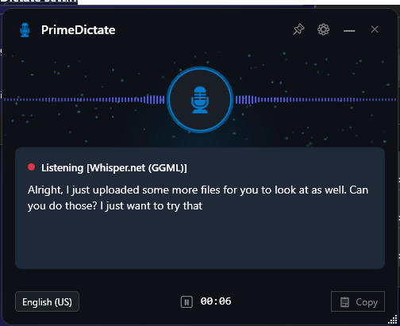
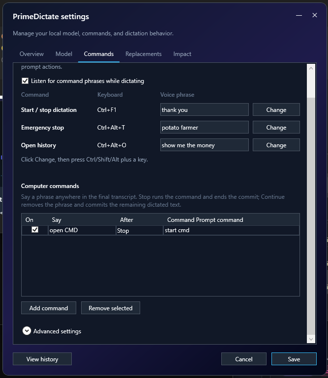
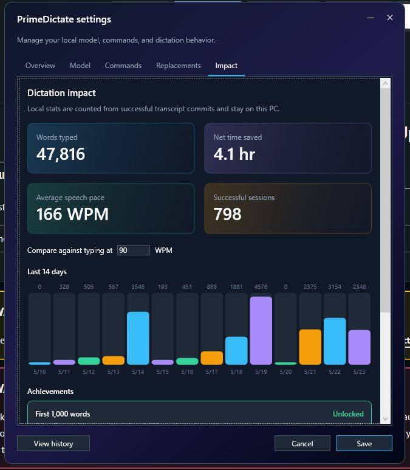
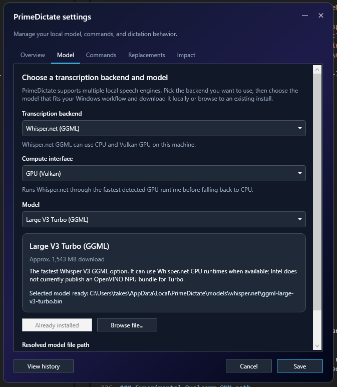
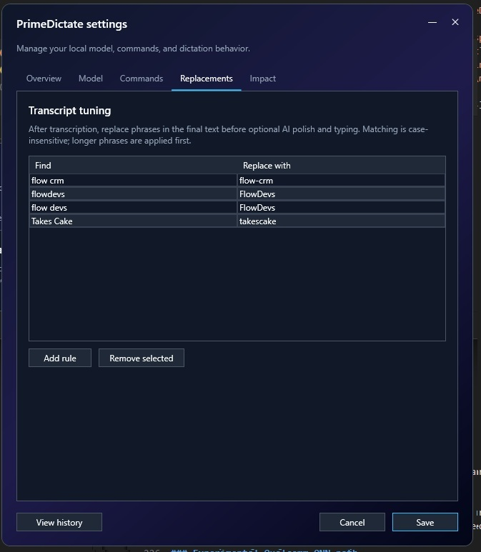
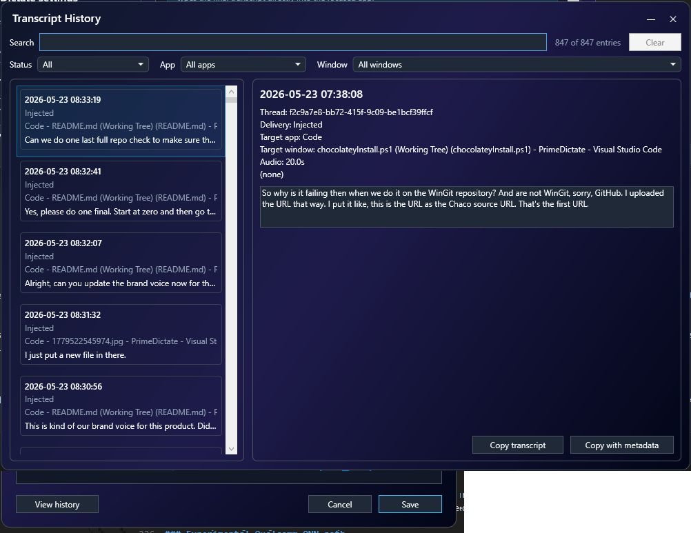
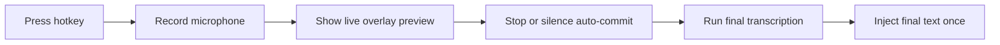

<div align="center">
  
  <br/>
  <h1>PrimeDictate</h1>
  <a href="https://github.com/flowdevs-io/PrimeDictate/actions/workflows/build.yml">
    
  </a>
  <p><b>Talking is faster than typing. PrimeDictate is local AI dictation for Windows that stays out of your way.</b></p>
  <p>Use one hotkey to speak, preview live transcript locally, and commit final text once. No cloud dependency in the core path. No clipboard paste hacks.</p>
  <br/>
  
  <br/><br/>
  
</div>

## What It Does

PrimeDictate is a tray-first dictation workflow for people who move faster by voice.

- Trigger dictation from configurable global hotkeys
- Capture the default Windows microphone with WASAPI
- Run transcription locally with local model files
- Keep live edits in the overlay instead of mutating the target app while you speak
- Inject final text once with SharpHook Unicode text entry
- Manage everything from a tray-first app with first-run setup, settings, history, updates, launch-at-login, and optional Ollama prompt modes

The current typing path does not rely on clipboard paste. That avoids clipboard races and paste timing issues in editors and browsers.

Why it feels different from basic desktop dictation tools:

- Live corrections stay in the overlay instead of fighting your editor while you speak.
- Final injection happens once, on commit, instead of backspacing and retyping into the target app.
- Models run locally, so the core transcription path does not depend on a cloud API.
- The app is optimized around tray-first use, fast toggling, and low-friction first-run setup.

## Why People Use It

PrimeDictate is a good fit when you want:

- local dictation without sending speech to a hosted transcription service
- a coding-friendly workflow where your editor is not constantly rewritten during live recognition
- a tray app you can leave running all day and toggle instantly from anywhere in Windows
- Windows-native packaging through direct MSI downloads, winget, or Chocolatey

It is usually faster to talk than type, so we open-sourced the workflow on Windows.

PrimeDictate supports polite send phrases like "thank you" and strips them before final injection, so your flow stays natural without polluting final text.



## Why It Wins

- **Global control**: Configurable hotkeys for start/stop toggle, emergency stop/discard, and history.
- **Live preview overlay**: Non-activating overlay shows local transcript hypotheses while dictation is in progress.
- **Final-only injection**: The focused app receives the final result once, after stop or silence auto-commit.
- **Voice commands**: Built-in phrases can commit, discard, open history, or trigger command prompt actions.
- **Tray workspace UI**: Open Workspace from the tray to review sessions, logs, and history in a clearer dashboard layout.
- **History and recovery**: Every committed transcript is saved locally with metadata and delivery status.
- **Impact stats**: Tracks local productivity metrics, milestones, average speaking pace in WPM, and recent usage history.
- **Model picker and downloads**: First-run setup and Settings can download supported models or browse to existing local folders.
- **Optional coding mode**: Sends Enter after a successful final injection.
- **Launch at login**: Installers enable launch at login by default; MSI and winget installs can opt out.
- **Built-in updater**: Checks GitHub Releases, downloads the matching MSI, verifies checksums, and hands off to Windows Installer.
- **Local rewrite modes**: Optional Ollama integration can post-process dictated text with context-aware prompt modes.


## Product Walkthrough

### Model setup

Pick your backend, compute interface, and model from the Settings model tab.



### Commands and phrases

Map hotkeys, voice phrases, and optional command actions so speaking and committing feels natural in your daily workflow.


### Transcript replacements

Tune frequent phrases before final typing so recurring terms normalize automatically.



### Transcript history

Review previous sessions, delivery targets, and transcript details in the history window.



## Get PrimeDictate

PrimeDictate currently targets Windows x64 and ARM64.

### Install options

| Option | Best for | Install |
|------|------|------|
| GitHub Releases | Direct MSI download | `https://github.com/flowdevs-io/PrimeDictate/releases/latest` |
| winget | Standard Windows package install | `winget install --id FlowDevs.PrimeDictate --exact` |
| Chocolatey | Chocolatey-managed environments | `choco install primedictate -y` |

Important:

- The MSI installs the app only. Model download happens in PrimeDictate during first-run setup or later in Settings.
- Chocolatey Community Repository pages show only approved versions publicly. A successful upload may remain invisible until moderation completes.
- ARM64 Windows should use the native ARM64 installer or package when available.

### Which install path should you use?

- **GitHub Releases** if you want the newest MSI directly
- **winget** if you already manage desktop apps with winget
- **Chocolatey** if your environment already standardizes on Chocolatey

### Silent install and upgrade commands

- MSI install x64: `msiexec /i PrimeDictate-Setup-vX.Y.Z-x64.msi /qn /norestart`
- MSI install ARM64: `msiexec /i PrimeDictate-Setup-vX.Y.Z-arm64.msi /qn /norestart`
- MSI install without launch at login: `msiexec /i PrimeDictate-Setup-vX.Y.Z-<arch>.msi LAUNCHATLOGIN=0 /qn /norestart`
- MSI uninstall: `msiexec /x PrimeDictate-Setup-vX.Y.Z-<arch>.msi /qn /norestart`
- winget install: `winget install --id FlowDevs.PrimeDictate --exact --silent --accept-package-agreements --accept-source-agreements`
- winget install without launch at login: `winget install --id FlowDevs.PrimeDictate --exact --silent --accept-package-agreements --accept-source-agreements --override "LAUNCHATLOGIN=0"`
- winget upgrade: `winget upgrade --id FlowDevs.PrimeDictate --exact --silent --accept-package-agreements --accept-source-agreements`
- winget uninstall: `winget uninstall --id FlowDevs.PrimeDictate --exact --silent`
- Chocolatey install: `choco install primedictate -y`
- Chocolatey upgrade: `choco upgrade primedictate -y`
- Chocolatey uninstall: `choco uninstall primedictate -y`

## Get Dictating in 60 Seconds

1. Install PrimeDictate.
2. Launch it from Start Menu or let the Startup shortcut run it after sign-in.
3. Complete first-run setup.
4. Pick a backend and download or browse to a local model.
5. Focus the target app and use the dictation hotkey.

First-run setup handles:

- backend and model selection
- command phrases and transcript replacements
- overlay style and silence auto-commit timing
- coding mode, impact stats, and other core behavior

Impact tracking includes:

- average speech pace in words per minute (WPM)
- configurable typing comparison baseline in WPM

Dictation runtime flow:



Default controls:

- Start/stop toggle hotkey: `Ctrl+Shift+Space`
- Emergency stop/discard hotkey: `Ctrl+Shift+Enter`
- History hotkey: `Ctrl+Shift+H`
- Silence auto-commit delay: 3 seconds

Pro tips:

- Keep the caret in the field where you want text before starting.
- Do not switch apps while PrimeDictate is processing the final transcript if you want focus safety checks to pass.
- Use the overlay as live feedback; the target editor is updated only on final commit.
- Set silence delay to `0` if you want commits only from the hotkey.
- If you are testing model quality, start with short phrases first; larger models and longer recordings increase turnaround time.

## Requirements

- Windows is the primary supported platform.
- [.NET 8 SDK](https://dotnet.microsoft.com/download/dotnet/8.0) is required to build from source.
- Local transcription uses local model files only.
- sherpa-onnx backends require extracted ONNX model folders and tokens.
- Whisper.net uses GGML `.bin` files and optional hardware-specific sidecars.

## Local Models and Backends

PrimeDictate supports multiple local transcription backends. Setup and Settings expose a curated picker and download flow.

### Which backend should you start with?

| If you want... | Start here |
|------|------|
| The simplest English setup | `Base English ONNX` |
| The lightest/faster English setup | `Tiny English ONNX` |
| Better English accuracy with more compute | `Small English ONNX` or Whisper.net |
| An alternative English backend | Parakeet or Moonshine |
| Snapdragon X NPU experimentation | Qualcomm AI Hub Whisper on native ARM64 |

### Backend summary

| Backend | Typical use | Notes |
|------|------|------|
| Whisper ONNX | General-purpose local dictation | Uses sherpa-onnx encoder/decoder/token layout |
| Whisper.net GGML | Larger Whisper variants and optional GPU/NPU paths | Compute options depend on local runtime support |
| Parakeet ONNX | Alternative English local backend | Uses encoder/decoder/joiner/tokens layout |
| Moonshine ONNX | Lightweight English local backend | Smaller non-Whisper option |
| Qualcomm AI Hub Whisper | Experimental Snapdragon X NPU path | Native Windows ARM64 only |

### Model storage

Downloaded models are stored under `%LocalAppData%\PrimeDictate\models`.

- Whisper ONNX: `%LocalAppData%\PrimeDictate\models\whisper`
- Parakeet: `%LocalAppData%\PrimeDictate\models\parakeet`
- Moonshine: `%LocalAppData%\PrimeDictate\models\moonshine`
- Qualcomm AI Hub Whisper: `%LocalAppData%\PrimeDictate\models\qualcomm-aihub-whisper`

During development, PrimeDictate can also discover repo-local model folders under `models\...`.

### Expected model folder contents

Whisper ONNX expects:

- `*-encoder.int8.onnx` or `*-encoder.onnx`
- `*-decoder.int8.onnx` or `*-decoder.onnx`
- `*-tokens.txt`

Parakeet expects:

- `encoder.int8.onnx`
- `decoder.int8.onnx`
- `joiner.int8.onnx`
- `tokens.txt`

Moonshine expects:

- `preprocess.onnx`
- `encode.int8.onnx`
- `uncached_decode.int8.onnx`
- `cached_decode.int8.onnx`
- `tokens.txt`

### Whisper.net compute behavior

PrimeDictate normalizes unsupported saved Whisper.net hardware settings at startup.

- CPU is always available.
- GPU appears only when supported local Whisper.net GPU runtime support is present.
- NPU appears only for supported GGML models with the required sidecars.

### Experimental Qualcomm QNN path

The Qualcomm backend is experimental and intended for native Windows ARM64 builds on supported Snapdragon X devices.

It requires:

- Windows ARM64 process/runtime
- QNN runtime assets in the build output
- Qualcomm AI Hub Whisper wrapper package files, including `encoder.onnx`, `decoder.onnx`, context binaries, metadata, and tokenizer files
- Successful EPContext session creation without CPU fallback when strict validation is requested

Maintainer environment knobs:

- `PRIMEDICTATE_QNN_STRICT=1`
- `PRIMEDICTATE_QNN_CONTEXT_CACHE=0|1`
- `PRIMEDICTATE_QNN_CONTEXT_EMBED=0|1`
- `PRIMEDICTATE_QNN_PROFILE=basic|detailed|optrace`
- `PRIMEDICTATE_QNN_PROFILE_DIR=<path>`

## Build and Run From Source

From the repository root:

```powershell
dotnet run
```

The app starts in the tray. On first launch, complete setup, choose a model, then focus another application and start dictation.

Most contributors only need `dotnet run` and `dotnet build`. Publishing and installer generation are only needed when validating release outputs.

Common build commands:

```powershell
dotnet build -c Release
.\scripts\Publish-Windows.ps1
.\scripts\Build-Installers.ps1
```

Note: A running `PrimeDictate.exe` from `dotnet run` can lock the apphost on Windows. Stop the running instance before rebuilding if you hit copy or file-lock errors.

## Windows Installers

PrimeDictate ships MSI installers for x64 and ARM64 Windows using WiX through NuGet. No separate WiX installation is required.

| MSI | Behavior |
|-----|----------|
| Online x64 | Installs the x64 app under Program Files with Start Menu entry, ARP branding, and launch-at-login enabled by default |
| Online ARM64 | Installs the native ARM64 app with the same installer behavior and ARM64 runtime payload |

Installer characteristics:

- Installs app payload only; no install-time model download
- Does not launch the app from the finish dialog
- Uses consistent English installer UI resources
- Keeps upgrade identity for clean MSI upgrades
- Supports `LAUNCHATLOGIN=0` for unattended installs that should not auto-start on sign-in

For installer-specific details, see `installer/README.md`.

## Release and Distribution

Tagged pushes that match `vX.Y.Z` build the app, produce release assets, and publish to GitHub Releases.

In practice, the release pipeline keeps three public distribution channels aligned:

- GitHub Releases for direct MSI downloads
- winget for Windows package management
- Chocolatey for Chocolatey-managed environments

If you only want to install or evaluate PrimeDictate, you can stop reading here. The remaining release details are maintainer-facing.

### GitHub Releases

- Release page: `https://github.com/flowdevs-io/PrimeDictate/releases/tag/vX.Y.Z`
- Latest release: `https://github.com/flowdevs-io/PrimeDictate/releases/latest`
- Direct x64 MSI asset: `https://github.com/flowdevs-io/PrimeDictate/releases/download/vX.Y.Z/PrimeDictate-Setup-vX.Y.Z-x64.msi`
- Direct ARM64 MSI asset: `https://github.com/flowdevs-io/PrimeDictate/releases/download/vX.Y.Z/PrimeDictate-Setup-vX.Y.Z-arm64.msi`

If signing secrets are unavailable, the release flow still publishes unsigned assets instead of failing before upload.

### winget

- Package identifier: `FlowDevs.PrimeDictate`
- Source repository: `https://github.com/microsoft/winget-pkgs`

The same tag-triggered workflow generates versioned manifests from the release MSI assets, validates them, and optionally submits a winget PR when `WINGET_CREATE_GITHUB_TOKEN` is configured.

For resubmission without rebuilding binaries, use `workflow_dispatch` with:

- `submit_winget_only=true`
- `target_version=X.Y.Z`

### Chocolatey

- Package id: `primedictate`
- Community package page: `https://community.chocolatey.org/packages/primedictate`
- Community feed source: `https://community.chocolatey.org/api/v2/`
- Community push source: `https://push.chocolatey.org/`
- Moderation queue: `https://ch0.co/moderation`

The tag-triggered workflow also builds a Chocolatey `.nupkg` from the release assets and attempts to push it to the configured source.

GitHub Actions secrets:

- `CHOCO_API_KEY`
- `CHOCO_SOURCE_URL` (optional; defaults to `https://push.chocolatey.org/`)

Important moderation note:

- Chocolatey Community Repository only shows approved versions publicly.
- A version can be uploaded successfully and still remain invisible on the public package page while pending automated checks or human moderation.

### Maintainer release flow

<details>
<summary><b>Maintainer release details</b></summary>

From a clean `main` worktree:

```powershell
$Version = "4.3.1"

git status --short --branch
# Update Directory.Build.props to $Version before committing.
dotnet build -c Release

git add -A
git commit -m "release: v$Version"

git ls-remote --tags origin "refs/tags/v$Version"
git tag -a "v$Version" -m "v$Version"

git push origin main
git push origin "v$Version"
```

If the tag already exists, inspect the existing release instead of recreating it blindly.

</details>

## Configuration and Local Data

### User settings

User settings live at `%LocalAppData%\PrimeDictate\settings.json` and include:

- first-run completion
- launch-at-login scope
- hotkeys
- voice commands
- selected backend and model path
- overlay style and placement
- silence auto-commit delay
- return-to-original-target behavior
- audio cue toggle
- automatic update checks
- coding mode
- baseline typing speed for impact estimates

### Local data files

- Transcript history: `%LocalAppData%\PrimeDictate\history.json`
- Impact stats: `%LocalAppData%\PrimeDictate\stats.json`

## Architecture Overview

| Area | Technology |
|------|------------|
| Hotkey | SharpHook `SimpleGlobalHook` |
| Audio capture | NAudio `WasapiCapture` + `MediaFoundationResampler` to 16 kHz mono PCM |
| Live preview | `DictationController.LivePreviewLoopAsync` snapshots the buffer and re-runs the selected backend |
| Transcription | Shared engine host over Whisper, Parakeet, Moonshine, Whisper.net, and experimental Qualcomm paths |
| Overlay | WPF `TranscriptionOverlayWindow`, topmost and non-activating |
| Final injection | `WhisperTextInjectionPipeline` + SharpHook `EventSimulator.SimulateTextEntry` |
| Target safety | Foreground capture/restore helpers in `WindowsInputHelpers.cs` |

Why the app avoids clipboard paste:

- Clipboard restore races can cause the target app to paste stale clipboard data.
- Final-only simulated Unicode entry is the current baseline because it is more predictable across apps.

## Troubleshooting

- **No text injected**: Check whether focus changed between recording start and final processing.
- **Model not loading**: Verify the selected folder contains the expected files for that backend.
- **Build cannot replace PrimeDictate.exe**: Stop any running app instance before rebuilding.
- **Chocolatey version not visible**: Check the moderation queue; public package pages only show approved versions.

## For Maintainers

- Installer-specific packaging details live in `installer/README.md`
- Release automation is centered in `.github/workflows/build.yml`
- Versioning is driven from `Directory.Build.props`
- Chocolatey publishing uses `CHOCO_API_KEY` and optional `CHOCO_SOURCE_URL`
- winget submission requires `WINGET_CREATE_GITHUB_TOKEN`

## License

This repository's application code is provided as in-repo source. Follow the licenses of dependencies and the model publishers' terms when redistributing binaries or model files.

## About FlowDevs

**PrimeDictate** is built by **Justin Trantham**, Co-Founder and Prime Automator at [FlowDevs](https://flowdevs.io).

FlowDevs builds internal tools, workflow automation, integrations, and business software for teams that have outgrown spreadsheet-driven operations.

- [Visit FlowDevs.io](https://flowdevs.io)
- [Meet the Team](https://flowdevs.io/team)
- [Book a Discovery Call](https://booking.flowdevs.io)
